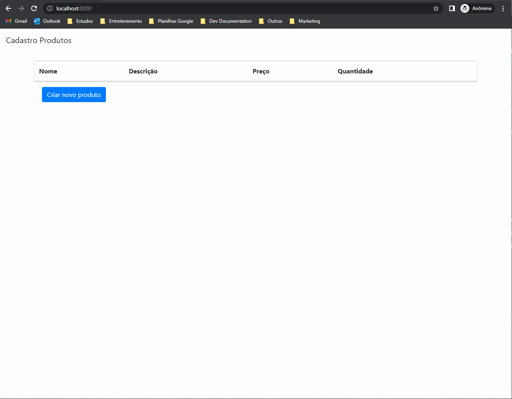

# crudExemploGO
Exemplo de um CRUD usando a linguagem GO

Banco de dados Utilizado: POSTGRESQL

### Para execução
go run main.go

 

#### Informações extras:
- go version go1.19 windows/amd64
- Utilizado a lib **pq**
- Para testes modificar o valor da senha da string de conexão, no arquivo __db/db.go__